# Introduction

Ceci est un document écrit en [R Markdown](http://rmarkdown.rstudio.com). Lorsque vous insérez du code `R` à l'intérieur de ce document, les résultats sont ajoutés automatiquement au document produit.

Essayez d'éxécuter le bloc de code ci-dessous en cliquant le bouton *Run* (il est représenté par une flèche verte pointant vers la droite) ou alors en plaçant votre curseur dans le bloc et en tapant *Ctrl+Shift+Enter*.


```r
plot(cars)
```

<!-- -->

Les documents en `R Markdown` se veulent être une solution pour faire de la [programmation lettrée](https://fr.wikipedia.org/wiki/Programmation_lettr%C3%A9e) et de la [recherche reproductible](https://en.wikipedia.org/wiki/Reproducibility#Reproducible_research).

Pour ajouter un nouveau bloc de code, vous appuyez sur le bouton *Insert* ou alors vous appuyez sur *Ctrl+Alt+I*.


```r
list.of.packages <- c("ggplot2", "broom", "MASS", "rmarkdown")
new.packages <- list.of.packages[!(list.of.packages %in% installed.packages()[,"Package"])]
if(length(new.packages)) install.packages(new.packages)
```


```r
library(ggplot2)
library(broom)
library(MASS)
library(rmarkdown)
```

Le bloc précédent ne sert qu'à initialiser des librairies que nous pourrons utiliser plus tard.

# Utilisation des données

Lorsque des données sont intialisées dans `R`, vous pouvez les visualiser avec la commande `View`.


```r
View(mtcars)
```

De plus, si les données sont des `tibbles` (un type précis de base de données), vous obtenez un résumé des données en tapant le nom.

Nous allons observer la base de données `diamonds`.

```r
diamonds
```

```
## # A tibble: 53,940 x 10
##    carat       cut color clarity depth table price     x     y     z
##    <dbl>     <ord> <ord>   <ord> <dbl> <dbl> <int> <dbl> <dbl> <dbl>
##  1  0.23     Ideal     E     SI2  61.5    55   326  3.95  3.98  2.43
##  2  0.21   Premium     E     SI1  59.8    61   326  3.89  3.84  2.31
##  3  0.23      Good     E     VS1  56.9    65   327  4.05  4.07  2.31
##  4  0.29   Premium     I     VS2  62.4    58   334  4.20  4.23  2.63
##  5  0.31      Good     J     SI2  63.3    58   335  4.34  4.35  2.75
##  6  0.24 Very Good     J    VVS2  62.8    57   336  3.94  3.96  2.48
##  7  0.24 Very Good     I    VVS1  62.3    57   336  3.95  3.98  2.47
##  8  0.26 Very Good     H     SI1  61.9    55   337  4.07  4.11  2.53
##  9  0.22      Fair     E     VS2  65.1    61   337  3.87  3.78  2.49
## 10  0.23 Very Good     H     VS1  59.4    61   338  4.00  4.05  2.39
## # ... with 53,930 more rows
```

Vous pouvez accéder à une variable en particulier en utilisant l'opérateur `$`. Pour ne pas encombrer l'écran, nous allons observer les 10 premières valeurs de la variable `cut`.

```r
diamonds$cut[1:10]
```

```
##  [1] Ideal     Premium   Good      Premium   Good      Very Good Very Good
##  [8] Very Good Fair      Very Good
## Levels: Fair < Good < Very Good < Premium < Ideal
```

# Statistiques descriptives

## Mesures de tendance centrale

### Le mode

Calculez le mode de la variable `cut`.

```r
table(diamonds$cut)
```

```
## 
##      Fair      Good Very Good   Premium     Ideal 
##      1610      4906     12082     13791     21551
```

> **Défi** :
> 
> Trouvez le mode de la variable `color`


```r
table(diamonds$color)
```

```
## 
##     D     E     F     G     H     I     J 
##  6775  9797  9542 11292  8304  5422  2808
```

### La moyenne

Calculez la moyenne (`mean`) de la variable `cut`.

```r
mean(diamonds$price)
```

```
## [1] 3932.8
```

> **Défi** :
> 
> Trouvez la moyenne de la variable `carat`


```r
mean(diamonds$carat)
```

```
## [1] 0.7979397
```

### La médiane

Calculez la médiane (`median`) de la variable `price`.

```r
median(diamonds$price)
```

```
## [1] 2401
```

> **Défi** :
> 
> Trouvez la médiane de la variable `carat`


```r
median(diamonds$carat)
```

```
## [1] 0.7
```

## Mesures de dispersion

### L'étendue

Calculez l'étendue (`range`) de la variable `carat`.

```r
res <- range(diamonds$carat)
res
```

```
## [1] 0.20 5.01
```

```r
res[2]-res[1]
```

```
## [1] 4.81
```

> **Défi** :
> 
> Trouvez l'étendue de la variable `price`


```r
res <- range(diamonds$price)
res
```

```
## [1]   326 18823
```

```r
res[2]-res[1]
```

```
## [1] 18497
```

### La variance

Calculez la variance (`var`) de la variable `price`.

```r
var(diamonds$price)
```

```
## [1] 15915629
```

> **Défi** :
> 
> Trouvez la variance de la variable `carat`


```r
var(diamonds$carat)
```

```
## [1] 0.2246867
```

### L'écart-type

Calculez l'écart-type (`sd`) de la variable `carat`.

```r
sd(diamonds$carat)
```

```
## [1] 0.4740112
```

> **Défi** :
> 
> Trouvez l'écart-type de la variable `price`


```r
sd(diamonds$price)
```

```
## [1] 3989.44
```

### Le coefficient de variation

Calculez le coefficient de variation de la variable `price`.

```r
prix <- diamonds$price
sd(prix)/mean(prix)*100
```

```
## [1] 101.4402
```

> **Défi** :
> 
> Trouvez le coefficient de variation de la variable `carat`


```r
carat <- diamonds$carat
sd(carat)/mean(carat)*100
```

```
## [1] 59.40439
```

## Mesures de position

### La cote z

Calculez la cote z d'un diamant de prix 650$.

```r
(650-mean(prix))/sd(prix)
```

```
## [1] -0.8228724
```

### Les quantiles

Calculez certains quantiles (`quantile`) de la variable `carat`.

```r
quantile(diamonds$carat, 0.1)
```

```
##  10% 
## 0.31
```

```r
quantile(diamonds$carat, 0.75)
```

```
##  75% 
## 1.04
```

```r
quantile(diamonds$carat, 0.91)
```

```
##  91% 
## 1.51
```

Utilisez la commande `summary` sur la variable `price`.

```r
summary(diamonds$price)
```

```
##    Min. 1st Qu.  Median    Mean 3rd Qu.    Max. 
##     326     950    2401    3933    5324   18823
```

> **Défi** :
> 
> Trouvez le sommaire de la variable `carat`


```r
summary(diamonds$carat)
```

```
##    Min. 1st Qu.  Median    Mean 3rd Qu.    Max. 
##  0.2000  0.4000  0.7000  0.7979  1.0400  5.0100
```

### Le rang centile

Calculez le rang centile d'un diamant valant 850$.

```r
mean(diamonds$price<=850)
```

```
## [1] 0.2062291
```

# Tableaux

## Tableaux à une variable

Nous pouvons créer un tableau à une variable à l'aide de la commande `table`. Créez une table de la variable `cut` de la base de données `diamonds`.

```r
table(diamonds$cut)
```

```
## 
##      Fair      Good Very Good   Premium     Ideal 
##      1610      4906     12082     13791     21551
```

> **Défi** :
> 
> Faites un tableau de la variable `color`


```r
table(diamonds$color)
```

```
## 
##     D     E     F     G     H     I     J 
##  6775  9797  9542 11292  8304  5422  2808
```

Nous pouvons ajouter le total à une table en utilisant la commande `adddmargins`.

```r
addmargins(table(diamonds$cut))
```

```
## 
##      Fair      Good Very Good   Premium     Ideal       Sum 
##      1610      4906     12082     13791     21551     53940
```

## Tableaux à deux variables

Nous pouvons aussi créer des tableaux à deux variables avec la commande `table`. Créez un tableau avec les variables  `cut` et `color` de la base de données `diamonds`.

```r
table(diamonds$cut,diamonds$color)
```

```
##            
##                D    E    F    G    H    I    J
##   Fair       163  224  312  314  303  175  119
##   Good       662  933  909  871  702  522  307
##   Very Good 1513 2400 2164 2299 1824 1204  678
##   Premium   1603 2337 2331 2924 2360 1428  808
##   Ideal     2834 3903 3826 4884 3115 2093  896
```

Vous pouvez également représentez votre tableau en utilisant des proportions avec la commande `prop.table`.

```r
prop.table(table(diamonds$cut,diamonds$color))
```

```
##            
##                       D           E           F           G           H
##   Fair      0.003021876 0.004152762 0.005784205 0.005821283 0.005617353
##   Good      0.012272896 0.017296997 0.016852058 0.016147571 0.013014461
##   Very Good 0.028049685 0.044493882 0.040118650 0.042621431 0.033815350
##   Premium   0.029718205 0.043325918 0.043214683 0.054208380 0.043752317
##   Ideal     0.052539859 0.072358176 0.070930664 0.090545050 0.057749351
##            
##                       I           J
##   Fair      0.003244346 0.002206155
##   Good      0.009677419 0.005691509
##   Very Good 0.022321098 0.012569522
##   Premium   0.026473860 0.014979607
##   Ideal     0.038802373 0.016611049
```

Vous pouvez ajouter une ligne et une colonne de **totaux** avec des fréquences.

```r
addmargins(table(diamonds$cut,diamonds$color))
```

```
##            
##                 D     E     F     G     H     I     J   Sum
##   Fair        163   224   312   314   303   175   119  1610
##   Good        662   933   909   871   702   522   307  4906
##   Very Good  1513  2400  2164  2299  1824  1204   678 12082
##   Premium    1603  2337  2331  2924  2360  1428   808 13791
##   Ideal      2834  3903  3826  4884  3115  2093   896 21551
##   Sum        6775  9797  9542 11292  8304  5422  2808 53940
```

Vous pouvez ajouter une ligne et une colonne de **totaux** avec des fréquences relatives.

```r
addmargins(prop.table(table(diamonds$cut,diamonds$color)))
```

```
##            
##                       D           E           F           G           H
##   Fair      0.003021876 0.004152762 0.005784205 0.005821283 0.005617353
##   Good      0.012272896 0.017296997 0.016852058 0.016147571 0.013014461
##   Very Good 0.028049685 0.044493882 0.040118650 0.042621431 0.033815350
##   Premium   0.029718205 0.043325918 0.043214683 0.054208380 0.043752317
##   Ideal     0.052539859 0.072358176 0.070930664 0.090545050 0.057749351
##   Sum       0.125602521 0.181627735 0.176900260 0.209343715 0.153948832
##            
##                       I           J         Sum
##   Fair      0.003244346 0.002206155 0.029847979
##   Good      0.009677419 0.005691509 0.090952911
##   Very Good 0.022321098 0.012569522 0.223989618
##   Premium   0.026473860 0.014979607 0.255672970
##   Ideal     0.038802373 0.016611049 0.399536522
##   Sum       0.100519095 0.052057842 1.000000000
```

# Graphiques

En langage `R`, il existe plusieurs façons de faire des graphiques.

- Les graphiques de `base` ou `traditionnels`.
- La librairie `lattice` qui est incluse dans `R` mais que nous devons charger.
- La librairie `ggplot2` qui doit être installé **et** chargée.

Pour cet atelier, nous utiliserons la librairie [`ggplot2`](http://ggplot2.org/) qui est la plus utilisée pour produire des graphiques en `R`.

Dans la librairie `ggplot2`, il y a deux façons de produire des graphiques:

- La commande `qplot`, qui correspond à __quick plot__. Cette commande produit des graphiques rapidement en tentant de choisir le bon graphique en fonction des variables utilisées.
- La commande `ggplot`, qui permet d'avoir beaucoup plus de précision sur la sortie graphique.

## Les variables qualitatives

### Le diagramme à bandes

Tracez le diagramme à bandes de la variable `clarity`.

```r
qplot(diamonds$clarity, xlab="Clarté", ylab="Fréquence", main="Un beau titre...")
```

<!-- -->

En utilisant `ggplot`.

```r
ggplot(diamonds, aes(clarity)) + 
  geom_bar() +
  labs(
    x = "Clarté",
    y = "Fréquence",
    title = "Un beau titre...")
```

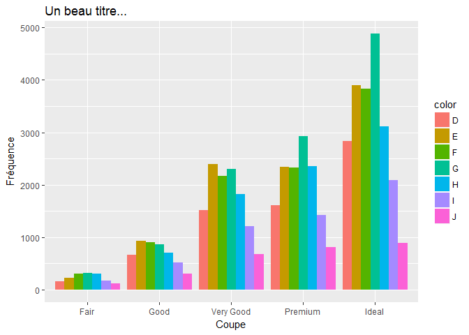<!-- -->

## Les variables quantitatives

### Le diagramme à bâtons

Tracez le diagramme à bâtons de la variable `cyl` de la base de données `mtcars` (Cette base de données est toujours disponible dans `R`).

```r
qplot(mtcars$cyl, xlab="Nombre de cylindres", ylab="Fréquence", main="Un beau titre...")
```

```
## `stat_bin()` using `bins = 30`. Pick better value with `binwidth`.
```

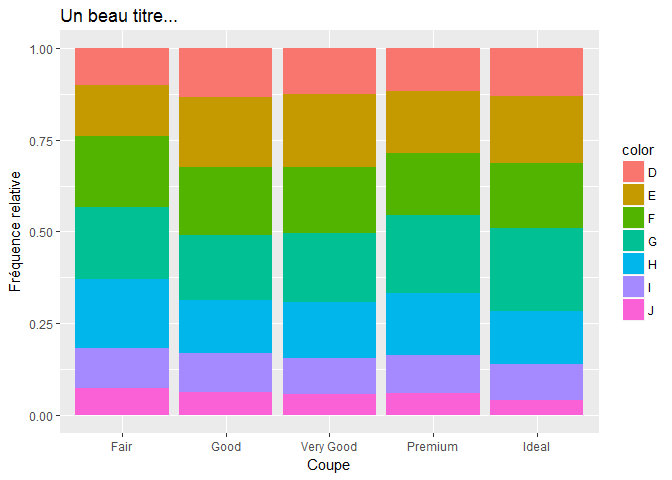<!-- -->

En utilisant `ggplot`.

```r
ggplot(mtcars, aes(cyl)) +
  geom_bar(width = 0.1) +
  labs(
    x = "Nombre de cylindres",
    y = "Fréquence",
    title = "Un beau titre...")
```

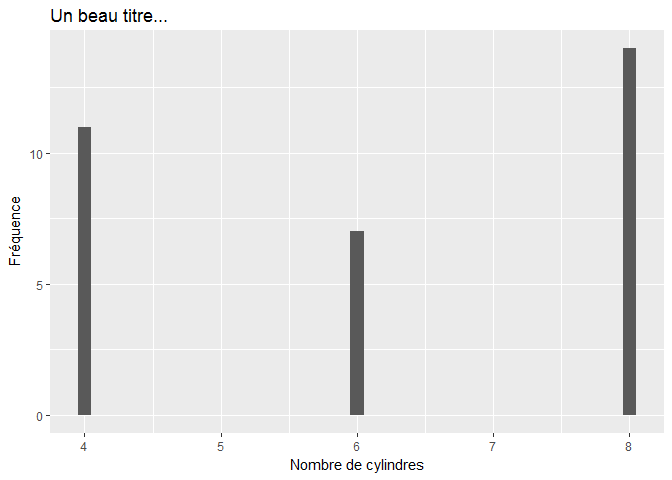<!-- -->

### L'histogramme

Tracez l'histogramme de la variable `price`.

```r
qplot(diamonds$price, xlab="Prix", ylab="Fréquence", main="Un beau titre...")
```

```
## `stat_bin()` using `bins = 30`. Pick better value with `binwidth`.
```

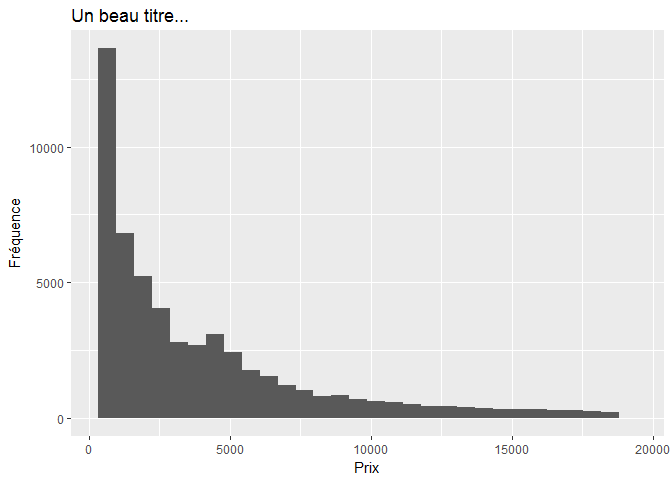<!-- -->

En utilisant `ggplot`.

```r
ggplot(diamonds, aes(price)) +
  geom_histogram(color = "white", binwidth = 1000, center = 500) +
  labs(
    x = "Prix", 
    y = "Fréquence", 
    title = "Un beau titre...")
```

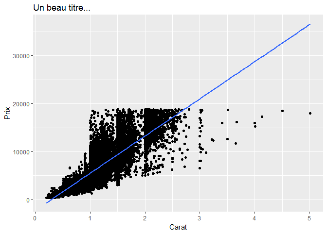<!-- -->

### Le polygone de fréquences

Tracez le polygone de fréquences de la variable `price`.

```r
ggplot(diamonds, aes(price)) +
  geom_freqpoly(size = 1, binwidth = 1000, center = 500) +
  labs(
    x = "Prix", 
    y = "Fréquence", 
    title = "Un beau titre...")
```

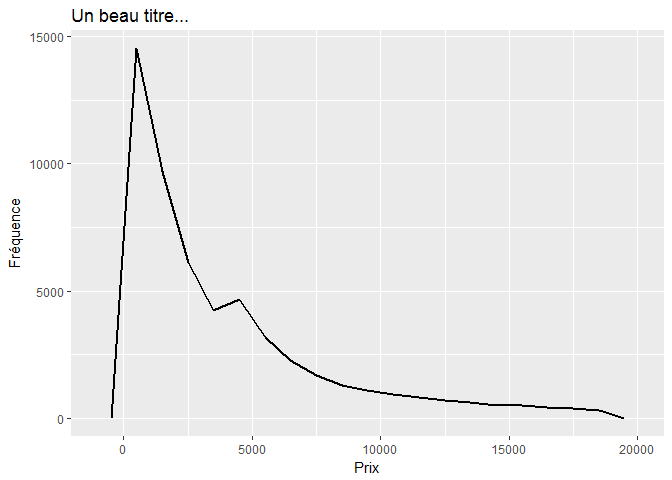<!-- -->

Tracez l'histogramme et le polygone de fréquences superposés.

```r
ggplot(diamonds, aes(price)) +
  geom_histogram(color = "white", binwidth = 1000, center = 500) +
  geom_freqpoly(size = 1, binwidth = 1000, center = 500) +
  labs(
    x = "Prix", 
    y = "Fréquence", 
    title = "Un beau titre...")
```

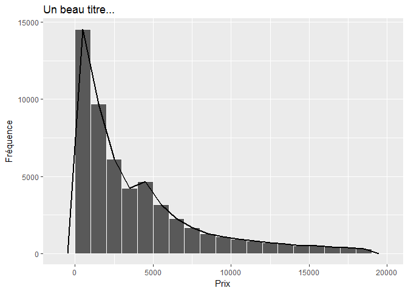<!-- -->

### L'ogive des pourcentages cumulés

Tracez le polygone de fréquences de la variable `price`.

```r
ggplot(diamonds, aes(price)) +
  stat_ecdf() +
  labs(
    x = "Prix", 
    y = "Fréquence relative cumulée", 
    title = "Un beau titre...")
```

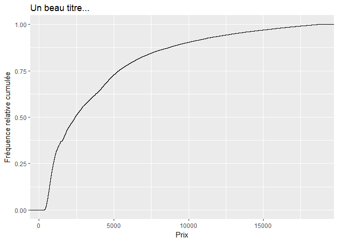<!-- -->

## Représenter deux variables

### Deux variables qualitatives

Tracez un diagramme à bandes comprenant la variable `cut` et la variable `color`. On utilise `aes` avec l'option `fill`.

```r
ggplot(diamonds, aes(x=cut, fill=color))+
  geom_bar()+
  labs(
    x = "Coupe",
    y = "Fréquence",
    title = "Un beau titre...")
```

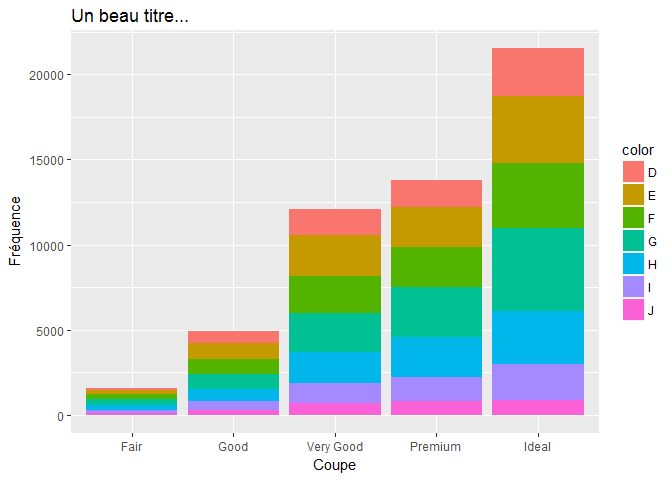<!-- -->

Tracez un diagramme à bandes comprenant la variable `cut` et la variable `color` avec les variables côtes à côtes. On utilise l'option `position="dodge"`.

```r
ggplot(diamonds, aes(x=cut, fill=color))+
  geom_bar(position ="dodge")+
  labs(
    x = "Coupe",
    y = "Fréquence",
    title = "Un beau titre...")
```

<!-- -->

Tracez un diagramme à bandes comprenant la variable `cut` et la variable `color` avec des fréquences relatives. On utilise l'option `position="fill"`.

```r
ggplot(diamonds, aes(x=cut, fill=color))+
  geom_bar(position ="fill")+
  labs(
    x = "Coupe",
    y = "Fréquence relative",
    title = "Un beau titre...")
```

<!-- -->

### Une variable qualitative et une variable quantitative

Faites une boîte à moustaches de la variable `price` en fonction de la variable `cut`.

```r
ggplot(diamonds, aes(x = cut, y = price)) + 
  geom_boxplot()+
  labs(
    x = "Coupe",
    y = "Prix",
    title = "Un beau titre...")
```

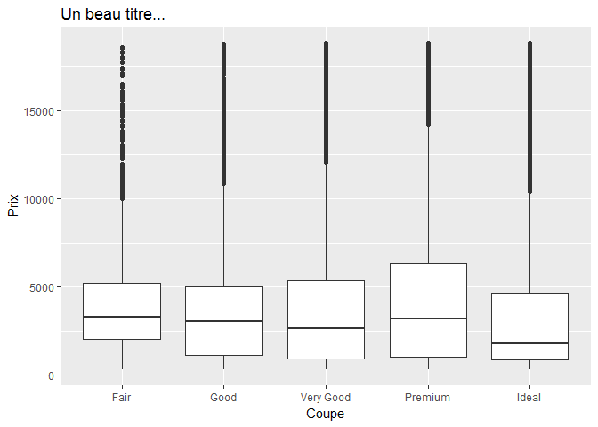<!-- -->

### Deux variables quantitatives

Tracez le nuage de points de la variable `price` en fonction de la variable `carat`.

```r
ggplot(diamonds, aes(x=carat, y=price))+
  geom_point()+
  labs(
    x = "Carat",
    y = "Prix",
    title = "Un beau titre...")
```

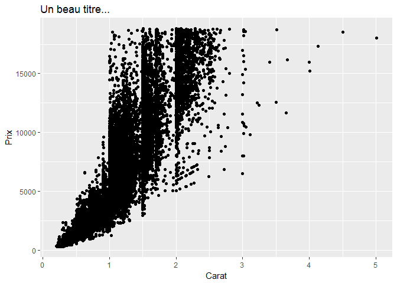<!-- -->

# Régression linéaire

Nous allons tracer la droite de régression sur le graphique représentant la variable `price`  en fonction de la variable `carat` de la base de données `diamonds`.

```r
ggplot(diamonds, aes(x=carat, y=price))+
  geom_point()+
  geom_smooth(method="lm")+
  labs(
    x = "Carat",
    y = "Prix",
    title = "Un beau titre...")
```

<!-- -->

Nous pouvons trouver les coefficients $a$ et $b$ de la droite $y=ax+b$ en utilisant la commande `lm`.

```r
lmfit <- lm(formula = price ~ carat, data = diamonds)
```

Pour visualiser les coefficients de votre régression linéaire, vous utilisez la commande `tidy`.

```r
tidy(lmfit)
```

```
##          term  estimate std.error statistic p.value
## 1 (Intercept) -2256.361  13.05535 -172.8304       0
## 2       carat  7756.426  14.06658  551.4081       0
```

Pour obtenir les statistiques obtenues de la régression linéaire, nous utilisons la commande `glance`.

```r
glance(lmfit)
```

```
##   r.squared adj.r.squared    sigma statistic p.value df    logLik      AIC
## 1 0.8493305     0.8493277 1548.562  304050.9       0  2 -472730.3 945466.5
##        BIC     deviance df.residual
## 1 945493.2 129345695398       53938
```

Pour obtenir les valeurs de la régression linéaire obtenues à partir des points originaux, vous utilisez la commande `augment`. La commande `head` n'est présente que pour visualiser les premières lignes de la sortie.

```r
head(augment(lmfit))
```

```
## Warning: Deprecated: please use `purrr::possibly()` instead
```

```
## Warning: Deprecated: please use `purrr::possibly()` instead
```

```
## Warning: Deprecated: please use `purrr::possibly()` instead
```

```
## Warning: Deprecated: please use `purrr::possibly()` instead
```

```
## Warning: Deprecated: please use `purrr::possibly()` instead
```

```
##   price carat     .fitted   .se.fit   .resid         .hat   .sigma
## 1   326  0.23 -472.382688 10.405828 798.3827 4.515399e-05 1548.572
## 2   326  0.21 -627.511200 10.623347 953.5112 4.706148e-05 1548.571
## 3   327  0.23 -472.382688 10.405828 799.3827 4.515399e-05 1548.572
## 4   334  0.29   -6.997151  9.772834 340.9972 3.982758e-05 1548.576
## 5   335  0.31  148.131362  9.569076 186.8686 3.818413e-05 1548.576
## 6   336  0.24 -394.818432 10.298227 730.8184 4.422500e-05 1548.573
##        .cooksd .std.resid
## 1 6.001647e-06  0.5155756
## 2 8.922178e-06  0.6157543
## 3 6.016690e-06  0.5162214
## 4 9.656791e-07  0.2202069
## 5 2.780364e-07  0.1206747
## 6 4.925361e-06  0.4719441
```

# Intervalle de confiance

## Les intervalles de confiance sur une moyenne

Trouvons la moyenne du prix des diamants.

```r
mean(diamonds$price)
```

```
## [1] 3932.8
```

Nous allons trouver un intervalle de confiance au niveau de 95% de la moyenne du prix des diamants.

```r
tidy(t.test(diamonds$price,
            conf.level = 0.95))
```

```
##   estimate statistic p.value parameter conf.low conf.high
## 1   3932.8  228.9525       0     53939 3899.132  3966.467
##              method alternative
## 1 One Sample t-test   two.sided
```

Nous allons trouver un intervalle de confiance au niveau de 99% de la moyenne du prix des diamants.

```r
tidy(t.test(diamonds$price,
            conf.level = 0.99))
```

```
##   estimate statistic p.value parameter conf.low conf.high
## 1   3932.8  228.9525       0     53939 3888.552  3977.047
##              method alternative
## 1 One Sample t-test   two.sided
```

## Les intervalles de confiance sur une proportion

Trouvons la proportion de diamants de type `Ideal`.

```r
prop.table(table(diamonds$cut))
```

```
## 
##       Fair       Good  Very Good    Premium      Ideal 
## 0.02984798 0.09095291 0.22398962 0.25567297 0.39953652
```

La proportion est donc de $0.3995365$. Nous allons faire trouver un intervalle de confiance au niveau de 95% de la proportion dans la population des diamants de type `Ideal`.

```r
tidy(prop.test(with(diamonds,table(cut!="Ideal"))))
```

```
##    estimate statistic p.value parameter  conf.low conf.high
## 1 0.3995365  2177.245       0         1 0.3954011 0.4036863
##                                                 method alternative
## 1 1-sample proportions test with continuity correction   two.sided
```

Pour trouver un intervalle de confiance à 99%.

```r
tidy(prop.test(with(diamonds,table(cut!="Ideal")),
                 conf.level = 0.99))
```

```
##    estimate statistic p.value parameter  conf.low conf.high
## 1 0.3995365  2177.245       0         1 0.3941077 0.4049901
##                                                 method alternative
## 1 1-sample proportions test with continuity correction   two.sided
```

# Les tests d'hypothèses

## Les tests d'hypothèses à une variable

### Le test d'hypothèses sur une moyenne

Nous pouvons faire un test d'hypothèses bilatéral de niveau de confiance 95% sur la moyenne du prix des diamants. Par exemple, nous allons tenter de vérifier si le prix des diamants est **différent** de 3 900$.

```r
PrixDiff <- t.test(diamonds$price, 
            mu = 3900,
            alternative = "two.sided",
            paired = FALSE, 
            var.equal = FALSE, 
            conf.level = 0.95)
tidy(PrixDiff)
```

```
##   estimate statistic    p.value parameter conf.low conf.high
## 1   3932.8  1.909474 0.05620629     53939 3899.132  3966.467
##              method alternative
## 1 One Sample t-test   two.sided
```
Au niveau de confiance de 95%, nous ne pouvons pas conclure que le prix des diamants est différent de 3 900$ car nous obtenons une __p-value__ de $5.6206287$%. 

Nous pouvons vérifier si le prix des diamants est **plus grand** que 3 900$ au niveau de confiance de 90%.

```r
PrixPlusGrand <- t.test(diamonds$price, 
                  mu = 3900,
                  alternative = "greater",
                  paired = FALSE, 
                  var.equal = FALSE, 
                  conf.level = 0.90)
tidy(PrixPlusGrand)
```

```
##   estimate statistic    p.value parameter conf.low conf.high
## 1   3932.8  1.909474 0.02810314     53939 3910.786       Inf
##              method alternative
## 1 One Sample t-test     greater
```
Au niveau de confiance de 90%, nous pouvons conclure que le prix des diamants est plus grand que 3 900$ car nous obtenons une __p-value__ de $2.8103143$%. 

### Le test d'hypothèses sur une proportion

Nous pouvons faire un test d'hypothèses unilatéral de niveau de confiance 95% sur la proportion de diamants de type `Ideal`. Par exemple, nous allons tenter de vérifier si la proportion des diamants de type `Ideal` est **plus petite** que 0,405.

```r
IdealPlusPetit <- prop.test(with(diamonds,table(cut!="Ideal")),
                    p = 0.405,
                    alternative = "less",
                    conf.level = 0.95)
tidy(IdealPlusPetit)
```

```
##    estimate statistic     p.value parameter conf.low conf.high
## 1 0.3995365  6.658899 0.004933094         1        0 0.4030197
##                                                 method alternative
## 1 1-sample proportions test with continuity correction        less
```
Au niveau de confiance de 95%, nous pouvons conclure que la proportion de diamants de type `Ideal` est plus petite que 0,405 car nous obtenons une __p-value__ de $0.4933094$%.

## Les tests d'hypothèses à deux variables

### Les tests d'hypothèses sur une différence de deux moyennes

Nous pouvons faire un test d'hypothèses sur la différence entre le prix moyen des diamants de coupe `Ideal` et de coupe `Premium` au niveau de confiance  de 99%.

```r
IdealPremiumDiff <- t.test(formula = price ~ cut,
                      data = diamonds,
                      subset = cut %in% c("Ideal", "Premium"),
                      alternative = "two.sided",
                      paired = FALSE,
                      var.equal = FALSE,
                      conf.level = 0.99)
tidy(IdealPremiumDiff)
```

```
##   estimate estimate1 estimate2 statistic       p.value parameter conf.low
## 1 1126.716  4584.258  3457.542  24.91787 1.718905e-135  26552.16 1010.236
##   conf.high                  method alternative
## 1  1243.196 Welch Two Sample t-test   two.sided
```
Au niveau de confiance de 99%, nous pouvons conclure que la moyenne de prix des diamants `Ideal` est différente de la moyenne de prix des diamants `Premium` car nous obtenons une __p-value__ de $1.7189047\times 10^{-133}$%.

Pour faire un test d'hypothèses sur une différence de moyennes lorsque les échantillons sont pairés, nous allons utiliser une base de données disponible dans `R`, la base de données `immer`. Celle-ci donne la production d'orge pour les années 1931 et 1932. On peut la visualiser en utilisant la commande `head`.

```r
head(immer)
```

```
##   Loc Var    Y1    Y2
## 1  UF   M  81.0  80.7
## 2  UF   S 105.4  82.3
## 3  UF   V 119.7  80.4
## 4  UF   T 109.7  87.2
## 5  UF   P  98.3  84.2
## 6   W   M 146.6 100.4
```

Nous allons faire un test d'hypothèses bilatéral sur la différence de production d'orge entre les années 1931 et 1932 au niveau de confiance de 95%.

```r
BarleyPaired <- t.test(immer$Y1, 
                       immer$Y2,
                       paired=TRUE)
tidy(BarleyPaired)
```

```
##   estimate statistic     p.value parameter conf.low conf.high
## 1 15.91333  3.323987 0.002412634        29 6.121954  25.70471
##          method alternative
## 1 Paired t-test   two.sided
```
Au niveau de confiance de 95%, nous pouvons conclure que la moyenne de production d'orge est différente entre 1931 et 1932 car nous obtenons une __p-value__ de $0.2412634$%.

### Les tests d'hypothèses sur une différence de deux proportions

Nous pouvons faire un test sur la différence de poportions entre les diamants de coupe `Ideal` et les diamants de couleur `E`.

```r
PropPremiumE <- prop.test(with(diamonds,table(cut == "Premium",color == "E")))
tidy(PropPremiumE)
```

```
##   estimate1 estimate2 statistic      p.value parameter    conf.low
## 1 0.8141921 0.8305417  18.35038 1.837823e-05         1 -0.02372478
##      conf.high
## 1 -0.008974267
##                                                                 method
## 1 2-sample test for equality of proportions with continuity correction
##   alternative
## 1   two.sided
```
Au niveau de confiance de 95%, nous pouvons conclure que la proportion de diamants `Ideal` et de diamants de couleur `E` est différente car nous obtenons une __p-value__ de $0.0018378$%.

# Le test du $\chi^2$

## Le test du $\chi^2$ pour une variable

Voici le tableau représentant la variable `cut`.

```r
table(diamonds$cut)
```

```
## 
##      Fair      Good Very Good   Premium     Ideal 
##      1610      4906     12082     13791     21551
```

Nous voulons faire un test du $\chi^2$ pour savoir si toutes les modalités de la variable sont présentes de façon égales.

```r
ChiCut <- chisq.test(x = table(diamonds$cut))
tidy(ChiCut)
```

```
##   statistic p.value parameter                                   method
## 1  22744.55       0         4 Chi-squared test for given probabilities
```

## Le test du $\chi^2$ pour deux variables

Voici le tableau représentant la variable `cut` et la variable `color`.

```r
table(diamonds$cut,diamonds$color)
```

```
##            
##                D    E    F    G    H    I    J
##   Fair       163  224  312  314  303  175  119
##   Good       662  933  909  871  702  522  307
##   Very Good 1513 2400 2164 2299 1824 1204  678
##   Premium   1603 2337 2331 2924 2360 1428  808
##   Ideal     2834 3903 3826 4884 3115 2093  896
```

Nous voulons faire un test du $\chi^2$ pour savoir si la  variable `cut` dépend de la variable `color`.

```r
ChiCutColor <- chisq.test(x = table(diamonds$cut, diamonds$color))
tidy(ChiCutColor)
```

```
##   statistic      p.value parameter                     method
## 1  310.3179 1.394512e-51        24 Pearson's Chi-squared test
```

# Informations sur la version de `R` utilisée


```r
sessionInfo()
```

```
## R version 3.4.2 (2017-09-28)
## Platform: x86_64-w64-mingw32/x64 (64-bit)
## Running under: Windows 7 x64 (build 7601) Service Pack 1
## 
## Matrix products: default
## 
## locale:
## [1] LC_COLLATE=French_Canada.1252  LC_CTYPE=French_Canada.1252   
## [3] LC_MONETARY=French_Canada.1252 LC_NUMERIC=C                  
## [5] LC_TIME=French_Canada.1252    
## 
## attached base packages:
## [1] stats     graphics  grDevices utils     datasets  methods   base     
## 
## other attached packages:
## [1] rmarkdown_1.7.7 MASS_7.3-47     broom_0.4.2     ggplot2_2.2.1  
## 
## loaded via a namespace (and not attached):
##  [1] Rcpp_0.12.13     compiler_3.4.2   plyr_1.8.4       bindr_0.1       
##  [5] tools_3.4.2      digest_0.6.12    evaluate_0.10.1  tibble_1.3.4    
##  [9] gtable_0.2.0     nlme_3.1-131     lattice_0.20-35  pkgconfig_2.0.1 
## [13] rlang_0.1.4      psych_1.7.8      yaml_2.1.14      parallel_3.4.2  
## [17] bindrcpp_0.2     dplyr_0.7.4      stringr_1.2.0    knitr_1.17      
## [21] rprojroot_1.2    grid_3.4.2       glue_1.2.0       R6_2.2.2        
## [25] foreign_0.8-69   reshape2_1.4.2   tidyr_0.7.2      purrr_0.2.4     
## [29] magrittr_1.5     backports_1.1.1  scales_0.5.0     htmltools_0.3.6 
## [33] assertthat_0.2.0 mnormt_1.5-5     colorspace_1.3-2 labeling_0.3    
## [37] stringi_1.1.5    lazyeval_0.2.1   munsell_0.4.3
```

