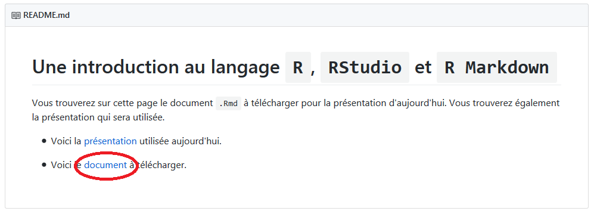
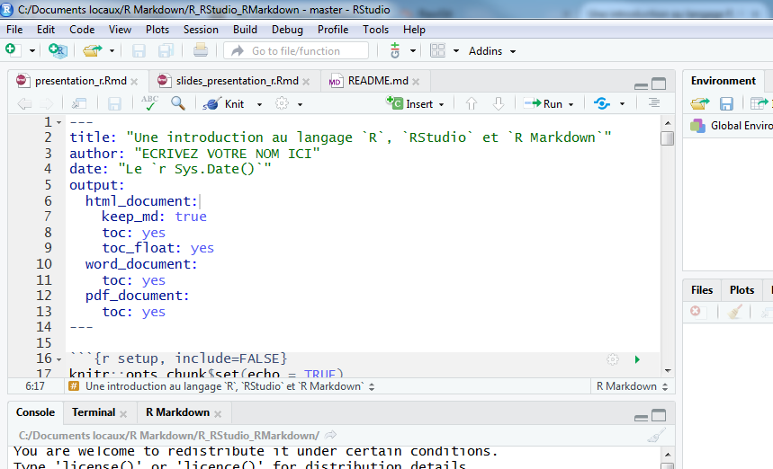
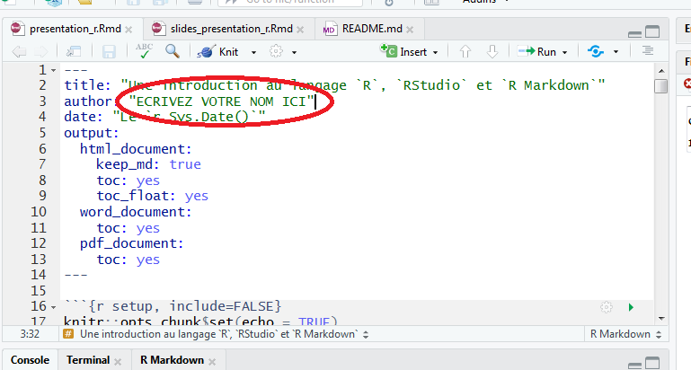
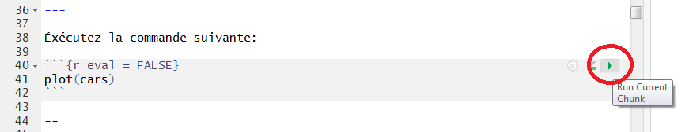
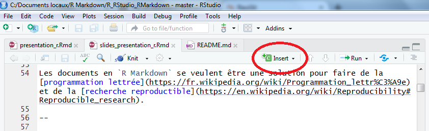

```{r setup, include=FALSE}
options(htmltools.dir.version = FALSE)
knitr::opts_chunk$set(fig.align = 'center')
```
class: middle

### Rendez-vous à l'adresse suivante:

## https://github.com/desautm/R_RStudio_RMarkdown

#### En arrivant à cette page, déroulez la page vers le bas et vous devez télécharger le document en cliquant avec le bouton droit de la souris.



#### Enregistrer votre fichier à un endroit où vous pourrez le retrouver et l'ouvrir avec `RStudio`.

---

### Une fois ouvert, vous devriez obtenir quelque chose de semblable à ceci.



---

### Vous devez écrire votre nom en remplacant le texte **"ECRIVEZ VOTRE NOM ICI"**.

### __Faites attention de conserver les guillemets__.



---

# Introduction

Le document sur lequel nous allons travailler est écrit en [R Markdown](http://rmarkdown.rstudio.com).

--

Lorsque vous insérez du code `R` à l'intérieur de ce document, les résultats sont ajoutés automatiquement au document produit.

--

Pour éxécuter un bloc de code, vous pouvez cliquer le bouton *Run* (il est représenté par une flèche verte pointant vers la droite) ou alors vous pouvez placer votre curseur dans le bloc et taper *Ctrl+Shift+Enter*.

--



---

Éxécutez la commande suivante:

```{r eval = FALSE}
plot(cars)
```

--

```{r, echo = FALSE}
plot(cars)
```

---

# Introduction

Les documents en `R Markdown` se veulent être une solution pour faire de la [programmation lettrée](https://fr.wikipedia.org/wiki/Programmation_lettr%C3%A9e) et de la [recherche reproductible](https://en.wikipedia.org/wiki/Reproducibility#Reproducible_research).

--

Pour ajouter un nouveau bloc de code, vous appuyez sur le bouton *Insert* ou alors vous appuyez sur *Ctrl+Alt+I*.

--



---

# Introduction

Les blocs suivants permettent d'installer de charger les librairies que nous utiliserons.

```{r}
list.of.packages <- c("ggplot2", "broom", "MASS", "rmarkdown")
new.packages <- list.of.packages[!(list.of.packages %in% installed.packages()[,"Package"])]
if(length(new.packages)) install.packages(new.packages)
```

```{r}
library(ggplot2)
library(broom)
library(MASS)
library(rmarkdown)
```

---

class: center, middle, inverse

# Utilisation des données

---

Lorsque des données sont intialisées dans `R`, vous pouvez les visualiser avec la commande `View`.

```{r}
View(mtcars)
```

--

De plus, si les données sont des `tibbles` (un type précis de base de données), vous obtenez un résumé des données en tapant le nom.

Nous allons observer la base de données `diamonds`.
```{r eval = FALSE}
diamonds
```

--

```{r echo = FALSE}
diamonds
```

---

Vous pouvez accéder à une variable en particulier en utilisant l'opérateur `$`. 

--

Pour ne pas encombrer l'écran, nous allons observer les 10 premières valeurs de la variable `cut`.

```{r eval = FALSE}
diamonds$cut[1:10]
```

--

```{r echo = FALSE}
diamonds$cut[1:10]
```

---
class: center, middle, inverse

# Statistiques descriptives

---
layout: true

## Mesures de tendance centrale
### Le mode

---

Calculez le mode de la variable `cut`.
```{r eval = FALSE}
table(diamonds$cut)
```

--

```{r echo = FALSE}
table(diamonds$cut)
```

Le mode est donc `Ideal`.

---

> **Défi** :
> 
> Trouvez le mode de la variable `color`

--

```{r, eval = FALSE}
table(diamonds$color)
```

--

```{r, echo = FALSE}
table(diamonds$color)
```

Le mode est donc `G`.

---
layout: false
layout: true

## Mesures de tendance centrale
### La moyenne

---

Calculez la moyenne (`mean`) de la variable `cut`.

--

```{r eval = FALSE}
mean(diamonds$price)
```

--

```{r echo = FALSE}
mean(diamonds$price)
```

La moyenne du prix des diamants est donc `r mean(diamonds$price)`$.

---

> **Défi** :
> 
> Trouvez la moyenne de la variable `carat`

--

```{r eval = FALSE}
mean(diamonds$carat)
```

--

```{r echo = FALSE}
mean(diamonds$carat)
```

La moyenne du nombre de carat des diamants est donc `r mean(diamonds$carat)` `r ifelse(mean(diamonds$carat)<2,'carat',carats)`.

---
layout: false
layout: true

## Mesures de tendance centrale
### La médiane

---

Calculez la médiane (`median`) de la variable `price`.

--

```{r eval = FALSE}
median(diamonds$price)
```

--

```{r echo = FALSE}
median(diamonds$price)
```

Nous avons donc que 50% des diamants ont un prix inférieur ou égal à `r median(diamonds$price)`$.

---

> **Défi** :
> 
> Trouvez la médiane de la variable `carat`

--

```{r eval = FALSE}
median(diamonds$carat)
```

--

```{r echo = FALSE}
median(diamonds$carat)
```

Nous avons donc que 50% des diamants ont un nombre de carats inférieur ou égal à `r median(diamonds$carat)` `r ifelse(median(diamonds$carat)<2,'carat','carats')`.

---
layout: false
layout: true

## Mesures de dispersion
### L'étendue

---

Calculez l'étendue (`range`) de la variable `carat`.

--

```{r eval = FALSE}
res <- range(diamonds$carat)
res
res[2]-res[1]
```

--

```{r echo = FALSE}
res <- range(diamonds$carat)
res
res[2]-res[1]
```

L'étendue du nombre de carat des diamants est donc `r res[2]-res[1]` `r ifelse(res[2]-res[1]<2,'carat','carats')`.

---

> **Défi** :
> 
> Trouvez l'étendue de la variable `price`

--

```{r eval = FALSE}
res <- range(diamonds$price)
res
res[2]-res[1]
```

--

```{r echo = FALSE}
res <- range(diamonds$price)
res
res[2]-res[1]
```

L'étendue du prix des diamants est donc de `r res[2]-res[1]`$.

---
layout: false
layout: true

## Mesures de dispersion
### La variance

---

Calculez la variance (`var`) de la variable `price`.

--

```{r eval=FALSE}
var(diamonds$price)
```

--

```{r echo=FALSE}
var(diamonds$price)
```

La variance du prix des diamants est donc de $`r var(diamonds$price)`$ $\text{dollars}^2$.

---

> **Défi** :
> 
> Trouvez la variance de la variable `carat`

--

```{r eval=FALSE}
var(diamonds$carat)
```

--

```{r echo=FALSE}
var(diamonds$carat)
```

La variance du nombre de carats des diamants est donc de `r var(diamonds$carat)` $\text{carat}^2$.

---
layout: false
layout: true

## Mesures de dispersion
### L'écart-type

---

Calculez l'écart-type (`sd`) de la variable `carat`.

--

```{r eval=FALSE}
sd(diamonds$carat)
```

--

```{r echo=FALSE}
sd(diamonds$carat)
```

L'écart-type du nombre de carat des diamants est `r sd(diamonds$carat)` `r ifelse(sd(diamonds$carat)<2,'carat','carats')`.

---

> **Défi** :
> 
> Trouvez l'écart-type de la variable `price`

--

```{r eval=FALSE}
sd(diamonds$price)
```

--

```{r echo=FALSE}
sd(diamonds$price)
```

L'écart-type du prix des diamants est `r sd(diamonds$price)` $.

---
layout: false
layout: true

## Mesures de dispersion
### Le coefficient de variation

---

Calculez le coefficient de variation de la variable `price`.

--

```{r eval=FALSE}
prix <- diamonds$price
sd(prix)/mean(prix)*100
```

--

```{r echo=FALSE}
prix <- diamonds$price
sd(prix)/mean(prix)*100
```

--

Le coefficient de variation du prix des diamants est donc de `r sd(prix)/mean(prix)*100`%.

---

> **Défi** :
> 
> Trouvez le coefficient de variation de la variable `carat`

--

```{r eval=FALSE}
carat <- diamonds$carat
sd(carat)/mean(carat)*100
```

--

```{r echo=FALSE}
carat <- diamonds$carat
sd(carat)/mean(carat)*100
```

Le coefficient de variation du nombre de carat des diamants est donc de `r sd(carat)/mean(carat)*100`%.

---
layout: false
layout: true

## Mesures de position
### La cote z

---

Calculez la cote z d'un diamant de prix 650$.

--

```{r eval=FALSE}
(650-mean(prix))/sd(prix)
```

--

```{r echo=FALSE}
(650-mean(prix))/sd(prix)
```

La cote z d'un diamant de 650$ est donc `r (650-mean(prix))/sd(prix)`.

---
layout: false
layout: true

## Mesures de position
### Les quantiles

---

Calculez certains quantiles (`quantile`) de la variable `carat`.

--

```{r eval=FALSE}
quantile(diamonds$carat, 0.1)
quantile(diamonds$carat, 0.75)
quantile(diamonds$carat, 0.91)
```

--

```{r echo=FALSE}
quantile(diamonds$carat, 0.1)
quantile(diamonds$carat, 0.75)
quantile(diamonds$carat, 0.91)
```

---

Utilisez la commande `summary` sur la variable `price`.

--

```{r}
summary(diamonds$price)
```

---

> **Défi** :
> 
> Trouvez le sommaire de la variable `carat`

--

```{r}
summary(diamonds$carat)
```

---
layout: false
layout: true

## Mesures de position
### Le rang centile

---

Calculez le rang centile d'un diamant valant 850$.

--

```{r}
mean(diamonds$price<=850)
```

Il y a donc `r mean(diamonds$price<=850)*100`% de diamants ayant un prix inférieur ou égal  à 850$.

---
layout: false
class: center, middle, inverse

# Les tableaux

---
layout: true

## Tableaux à une variable

---

Nous pouvons créer un tableau à une variable à l'aide de la commande `table`.

--

Créez une table de la variable `cut` de la base de données `diamonds`.

--

```{r eval=FALSE}
table(diamonds$cut)
```

--

```{r echo=FALSE}
table(diamonds$cut)
```

---

> **Défi** :
> 
> Faites un tableau de la variable `color`

--

```{r eval=FALSE}
table(diamonds$color)
```

--

```{r echo=FALSE}
table(diamonds$color)
```

---

Nous pouvons ajouter le total à une table en utilisant la commande `adddmargins`.

--

```{r eval=FALSE}
addmargins(table(diamonds$cut))
```

--

```{r echo=FALSE}
addmargins(table(diamonds$cut))
```

---
layout: false
layout: true

## Tableaux à deux variables

---

Nous pouvons aussi créer des tableaux à deux variables avec la commande `table`.

--

Créez un tableau avec les variables  `cut` et `color` de la base de données `diamonds`.

--

```{r eval=FALSE}
table(diamonds$cut,diamonds$color)
```

--

```{r echo=FALSE}
table(diamonds$cut,diamonds$color)
```

---

Vous pouvez également représentez votre tableau en utilisant des proportions avec la commande `prop.table`.

--

```{r eval=FALSE}
prop.table(table(diamonds$cut,diamonds$color))
```

--

```{r echo=FALSE}
prop.table(table(diamonds$cut,diamonds$color))
```

---

Vous pouvez ajouter une ligne et une colonne de **totaux** avec des fréquences.

--

```{r eval=FALSE}
addmargins(table(diamonds$cut,diamonds$color))
```

--

```{r echo=FALSE}
addmargins(table(diamonds$cut,diamonds$color))
```

---

Vous pouvez ajouter une ligne et une colonne de **totaux** avec des fréquences relatives.

--

```{r eval=FALSE}
addmargins(prop.table(table(diamonds$cut,diamonds$color)))
```

--

```{r echo=FALSE}
addmargins(prop.table(table(diamonds$cut,diamonds$color)))
```

---
layout: false
class: middle, center, inverse

# Graphiques

En langage `R`, il existe plusieurs façons de faire des graphiques.

- Les graphiques de `base` ou `traditionnels`.
- La librairie `lattice` qui est incluse dans `R` mais que nous devons charger.
- La librairie `ggplot2` qui doit être installé **et** chargée.

Pour cet atelier, nous utiliserons la librairie [`ggplot2`](http://ggplot2.org/) qui est la plus utilisée pour produire des graphiques en `R`.

Dans la librairie `ggplot2`, il y a deux façons de produire des graphiques:

- La commande `qplot`, qui correspond à __quick plot__. Cette commande produit des graphiques rapidement en tentant de choisir le bon graphique en fonction des variables utilisées.
- La commande `ggplot`, qui permet d'avoir beaucoup plus de précision sur la sortie graphique.